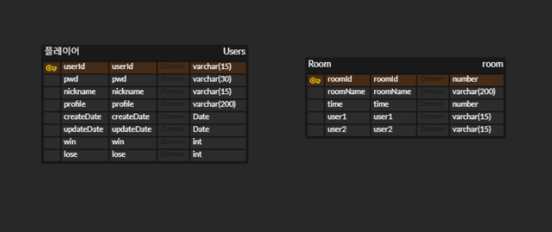
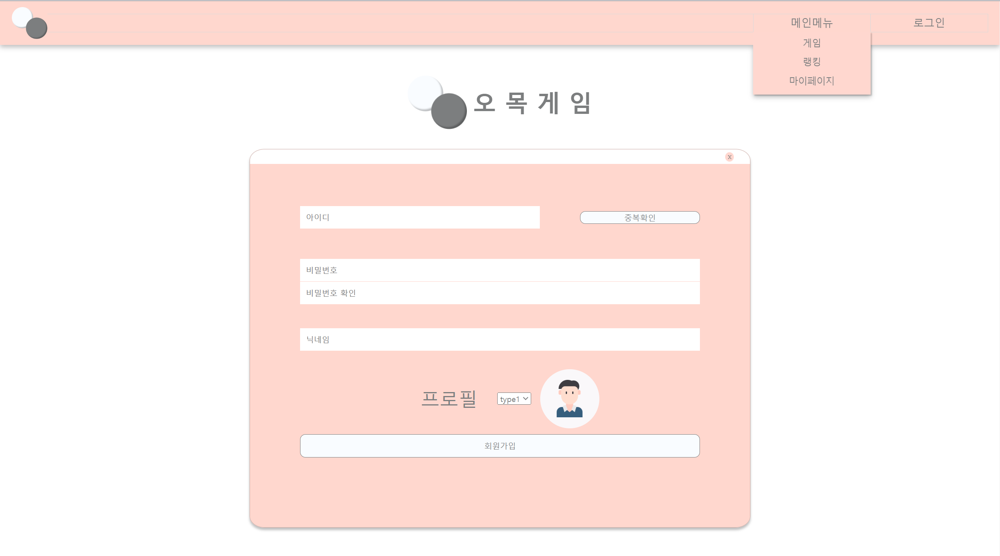
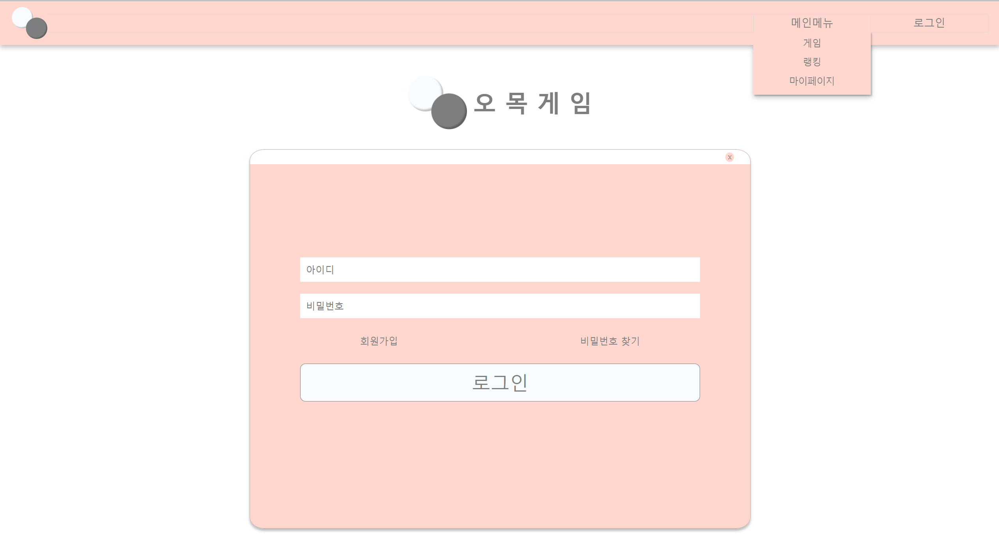
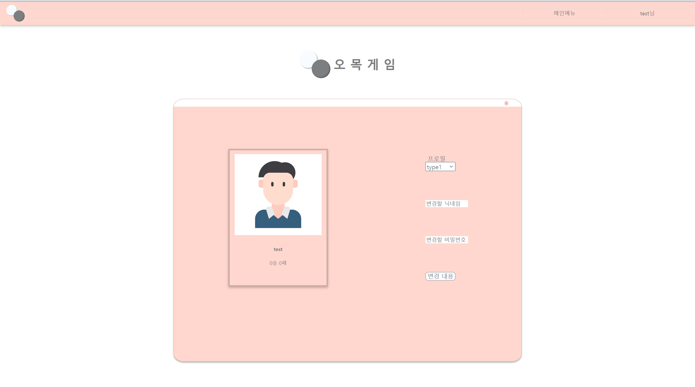
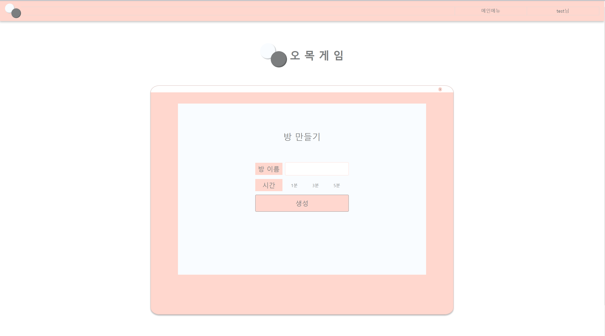
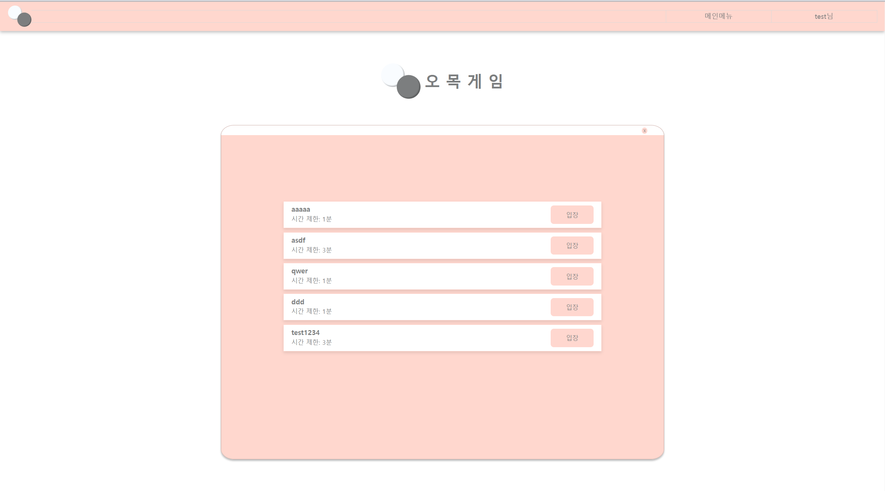
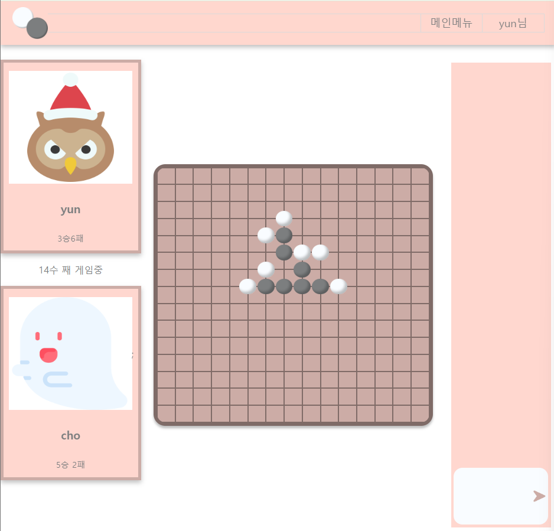
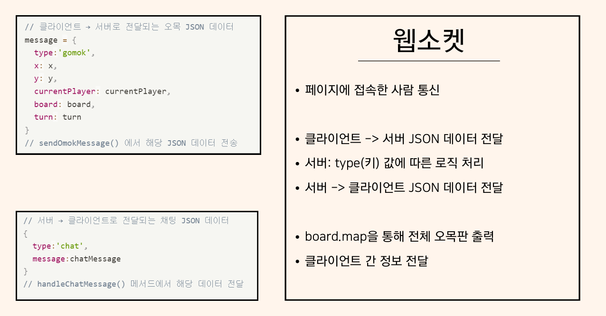
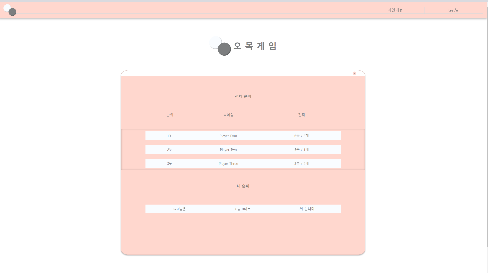

# 오목프로젝트


         


 

## 목차  
1. [프로젝트 구조](#1-프로젝트-구조)  
2. [ERD 및 테이블](#2-erd-및-테이블)  
3. [요구사항](#3-요구사항)  
4. [주요 기능](#4-주요-기능)  

## 1. 프로젝트 구조   
```
src
└─ main
    ├─ java
    │     ├─ admin (추가)
    │     ├─ account (User(=Member))
    │	  │     ├─ login 
    │	  │     │    ├─ LoginServlet - 로그인 체크, 세션, 포워드방식
    │	  │     │    └─	LogoutServlet	- session 회수(invalidate), post 로그인, get 로그아웃, https://blogshine.tistory.com/20	 			
    │	  │     └─ user
    │	  │         ├─ UserServlet - readUser, createUser, updateUser, deleteUser
    │	  │         ├─ UserDAO - DB관련
    │	  │         └─ UserVO	- ERD 나오면 결정										
    │     ├─ room 
    │     │    ├─ RoomServlet
    │     │    ├─ RoomDAO 
    │     │    └─ RoomVO
    │     └─ game 
    │         ├─ GameServer (돌고 있는 상태)
    │         ├─ GameClient	(좌표, user정보)
    │         ├─ GameInfo (승패 판정, 렌주룰 확인, 무르기(추가))
    │         ├─ GameDAO
    │         ├─ GameVO
    │         ├─ ChatServlet (어떻게 할지 논의)
    │         ├─ ChatDAO
    │         ├─ ChatVO
    │         └─ Rank 
    │
    └─ webapp (jsp) -> 피그마 화면 이름, 경로 달기
        ├─ index.jsp (메인페이지)
        ├─ css (공통으로 사용하는 css 저장 경로) 
        │			├─ common.css (헤더, 푸터, 메인컨테이너 등 모든 페이지에서 사용하는 요소)
        │			└─ reset.css (css 초기화)
        ├─ err (에러페이지) 
        │			├─ error404 (404에러 시)
        │			└─ error500 (500에러 시)
        ├─ layout (기본 레이아웃) 
        │			├─ header (공통 헤더 : css, jquery 등 공통 임포트 포함-모든 페이지 head의 최상위에 위치해야함))
        │			├─ mainContainer (메인-가운데 모달창 관련, main태그로 감싸서 include 방식으로 사용)
        │			└─ footer (공통 푸터 : 모든 페이지 body 태그 밖에 위치해야함)
        ├─ user (유저 정보 관련 페이지) 
        │			├─ loginForm (로그인 폼)
        │			├─ signup (회원가입 폼)
        │			└─ mypage (회원정보 수정 페이지)
        ├─ admin ##구현 X
        ├─ lobby (로그인 후 접속하기 -> 선택 페이지 + 룸리스트 공통 레이아웃)
        │     ├─ index (header, lobbyList, footer 임포트)
        │     ├─ lobbyList (각 구현 페이지 연결 링크 테이블로 구현)
        │     └─ roomList (임시 페이지 - room 관련 서블릿 구현 전 사용 더미)
        ├─ rank (랭킹 노출 페이지, 전체 3위 이내 순위 + 내 순위 보여줌)
        │     └─ rank (header, lobbyList, footer 임포트)
        ├─ room (현존 방 리스트, 방 생성 관련)
        │     ├─ list (서블릿으로 데이터 전송받아 현재 접근 가능한 룸 리스트 노출 페이지)
        │     └─ create (방 만들기 페이지)
        └─ game 
            ├─ chat (사용X, index로 옮기기 전 테스트 페이지)
            ├─ client (사용X, index로 옮기기 전 테스트 페이지)
            ├─ lose (구현X, 패배했을 때 노출 팝업)
            ├─ win (구현X, 승리했을 때 노출 팝업)
            └─ game (JS파일, 웹소켓, 게임 클라이언트 로직, 채팅 로직, 이벤트리스너 구현)
```

## 2. ERD 및 테이블



Users
```
create table users(
    userId varchar2(15) not null,
    pwd varchar2(30) not null,
    nickname varchar2(15) not null,
    profile varchar2(200) not null,
    createDate Date default sysdate not null,
    updateDate Date default sysdate not null,
    win int default 0,
    lose int default 0,
    constraint userId primary key (userId)
);

commit;
```
Room
```
CREATE TABLE room (
    roomId NUMBER PRIMARY KEY,
    roomName VARCHAR2(200),
    time NUMBER,
    user1 VARCHAR2(15),
    user2 VARCHAR2(15)
);
```

## 3. 요구사항  

미니 프로젝트
- 오목 웹버전으로 개발
- 웹소켓 적용
- ajax 적용
- DB 연동
- 기타 추가 기능(팀내 협의)
- 팀별 발표

## 4. 주요 기능  
회원가입

```
회원가입
- Ajax를 이용한 아이디 중복체크
```


로그인

```
로그인
- 인증 방식: session 이용
로그아웃
- session 회수
```

마이페이지

```
회원정보 수정
- 프로필, 닉네임, 비밀번호 변경 가능
```

방만들기

```
방 생성 (호스트)
- 방 이름, 제한시간 설정
- post 요청 ->  DB 저장

게임 참가 (게스트)
- 입장 -> 게임방Id 쿼리스트링 설정
```

방목록

```
방 찾기
- 방 리스트 DB 조회
```

게임화면


```
게임 알고리즘
- 턴 전환
- 수평, 수직, 대각선 5개의 같은 색 돌 확인

게임 룰
- 3x3 금지, 4x4 금지, 장목 승리 금지

오목, 채팅
- 실시간 업데이트 => 웹소켓

```

랭킹

```
랭킹 확인
- 상위 3명 조회
- 승리 수 기준*
- 사용자 순위 조회
```